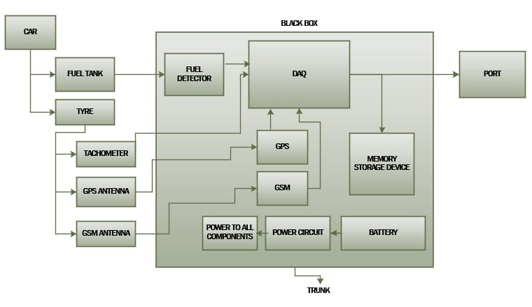
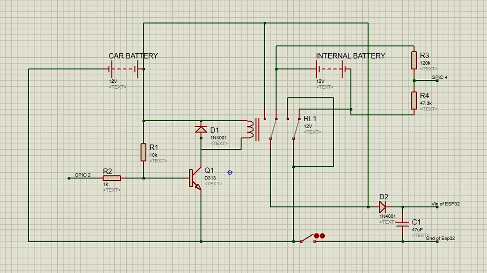
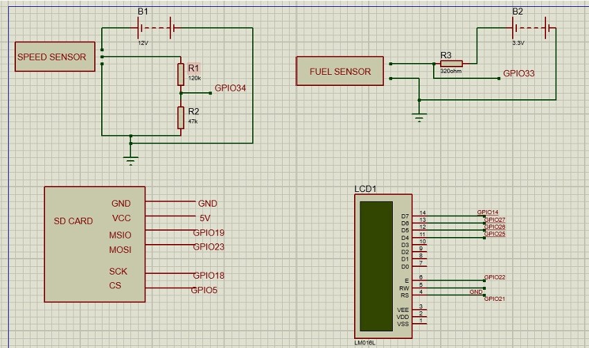
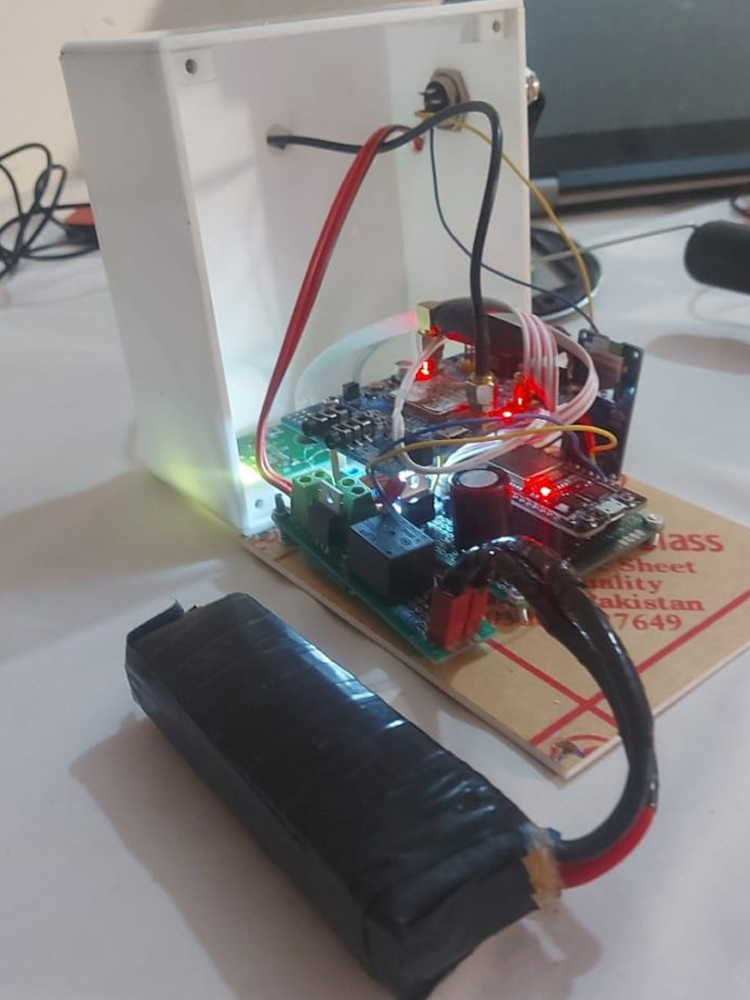
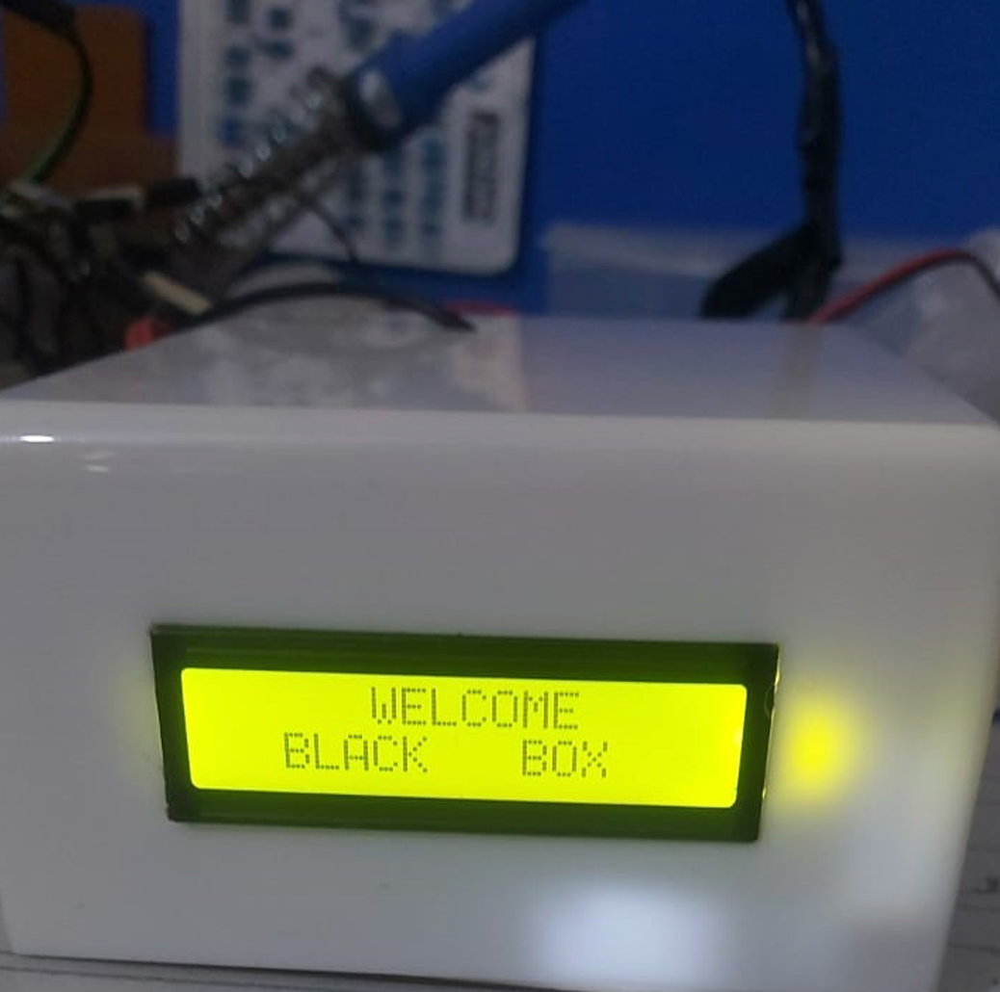

# 🚗 Automobile Black Box

**A Smart Tracking & Data Logging System for Vehicles**

 
# Creating an editable README.md file with the provided content  

## 🔍 Introduction
The **Automobile Black Box** functions similarly to an aircraft black box, designed to track, log, and report vehicle-related data, including:
- **GPS Location**
- **Speed Monitoring**
- **Fuel Logging**
- **Real-time SMS Alerts**
- **Accident Analysis & Anti-Theft Measures**

It provides insights into driving behavior and helps law enforcement, employers, and individuals track vehicle conditions.

---

## 📌 Features
✅ **Real-time Location Tracking** (via GPS & GSM)  
✅ **Accident Data Logging** (Logs speed, fuel, and GPS before an incident)  
✅ **Fuel Monitoring** (Detects fuel levels and theft)  
✅ **Speed Logging** (Monitors sudden changes)  
✅ **Smart Battery Management** (Prevents overcharging)  
✅ **SD Card Data Storage** (Offline access via card reader)  
✅ **Remote Inquiry via SMS** (Get updates via registered mobile numbers)  

---

## 🔧 Hardware Components
| Component         | Description |
|------------------|------------|
| **ESP32**        | Microcontroller for data processing |
| **SIM808 Module** | GPS + GSM module for tracking & communication |
| **Micro SD Card Module** | Stores data logs |
| **LCD Display (16x2)** | Shows status updates |
| **Fuel Sensor** | Detects fuel levels |
| **Speed Sensor** | Tracks vehicle speed |
| **Battery & Power Circuit** | Smart energy management system |

---

## 📜 How It Works
1. **Real-time Data Logging:** Logs speed, fuel, GPS, and other parameters.
2. **SMS Alerts:** Sends data to a registered mobile number upon request.
3. **Accident & Theft Detection:** Stores critical data before an accident occurs.
4. **Smart Power Management:** Ensures efficient battery usage.

---

## 🚀 Getting Started
### 1️⃣ Prerequisites
Before running the project, ensure you have:
- **Arduino IDE** installed
- ESP32 Board Library
- FS, SD, SPI, and LiquidCrystal libraries for data handling

### 2️⃣ Setting Up the Code
- Open **Arduino IDE**.
- Select **ESP32 Board** from Tools → Board.
- Upload the **black_box_code.ino** file.

### 3️⃣ Connecting Components
Refer to the circuit diagram below:

(Circuit 1)

(Circuit 2)

---

## 📡 SMS Commands
The system responds to **predefined SMS commands** from registered numbers:

| Command | Function |
|---------|----------|
| `1`     | Get GPS location |
| `2`     | Get current speed |
| `3`     | Get fuel level |
| `4`     | Check SD storage space |
| `5`     | Get battery status |
| `6`     | Retrieve all data |
| `7`     | Restart the system |

---

## 📊 Data Storage & Retrieval
- Logs data in **SD Card**.
- Stores **6 months of data**.
- Data can be read via a **card reader**.

---

## 🛠 Troubleshooting
| Issue | Solution |
|------|----------|
| GPS not receiving signal | Check antenna placement (outdoors recommended) |
| SIM808 not responding | Ensure proper power and network signal |
| SD card error | Format the SD card as **FAT32** |
| AT Commands not working | Try resetting the module |

---

## 🛠 Hardware Images

(Enternal Circuit after Connection)

(Front View of Device)

(Front View of Device)

---

## 📌 Future Improvements
🔹 **Integration with Cloud Storage** for remote data access  
🔹 **More sensors** for advanced analytics  
🔹 **Miniaturization** for compact design  

---

## 📜 License
This project is licensed under the **MIT License** – feel free to use and improve!

---

## 📞 Contact
📩 **Email:** mujeebciit72@gmail.com  
📍 **University:** Comsats University Islamabad, Wah Campus  
"""

---
